This blueprint implements a Process Automation Trigger that can be used for creating a case on SalesForce. When it is triggered, it will go through an Inbound Flow to collect the Copilot Summarization and create a case on SalesForce. To obtain the summary, an API will be called using the Conversation ID supplied from the trigger once the conversation is wrapped up. Finally, after retrieving the summary we can insert a record into SalesForce.

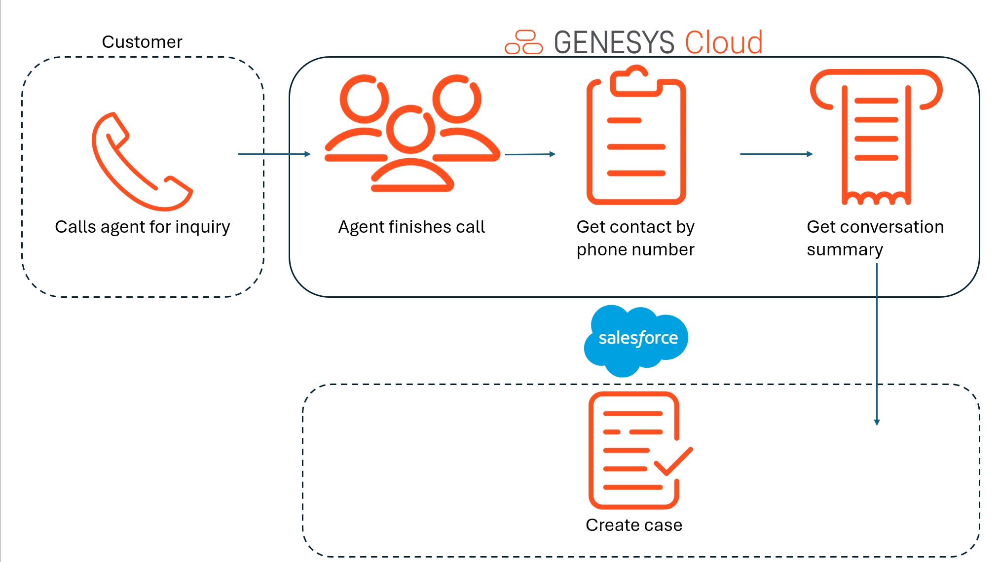

## Solution components

* **Genesys Cloud** - A suite of Genesys cloud services for enterprise-grade communications, collaboration, and contact center management. Contact center agents use the Genesys Cloud user interface.
* **Genesys Cloud API** - A set of RESTful APIs that enables you to extend and customize your Genesys Cloud environment.
* **Agent Copilot** - Enhances communication between the agent and the customer, see [About Genesys Agent Copilot](https://help.mypurecloud.com/articles/about-genesys-agent-copilot/ "Opens the About Genesys Agent Copilot article").
* **Data Action** - Provides the integration point to invoke a third-party REST web service or AWS lambda.
* **Architect flows** - A flow in Architect, a drag and drop web-based design tool, dictates how Genesys Cloud handles inbound or outbound interactions.
* **Triggers** - Provides the ability for a data action and architect workflow to work cohisively to perform the task.

## Prerequisites

### Specialized knowledge

* Administrator-level knowledge of Genesys Cloud
* Experience with using Agent Copilot

### Genesys Cloud account

* A Genesys Cloud CX 1 license. For more information, see [Genesys Cloud Pricing](https://www.genesys.com/pricing "Opens the Genesys Cloud pricing article").
* The Master Admin role in Genesys Cloud. For more information, see [Roles and permissions overview](https://help.mypurecloud.com/?p=24360 "Opens the Roles and permissions overview article") in the Genesys Cloud Resource Center.

## Implementation steps

You can implement Genesys Cloud objects manually or with Terraform.
* [Configure Genesys Cloud using Terraform](#configure-genesys-cloud-using-terraform)
* [Configure Genesys Cloud manually](#configure-genesys-cloud-manually)

### Download the repository containing the project files

Clone the [process-automation-trigger-with-salesforce repository](https://github.com/GenesysCloudBlueprints/process-automation-trigger-with-salesforce "Goes to the process-automation-trigger-with-salesforce repository") in GitHub.

## Configure Genesys Cloud using Terraform

### Set up Genesys Cloud

1. Set the following environment variables in a terminal window before you run this project using the Terraform provider:

   * `GENESYSCLOUD_OAUTHCLIENT_ID` - This variable is the Genesys Cloud client credential grant Id that CX as Code executes against. 
   * `GENESYSCLOUD_OAUTHCLIENT_SECRET` - This variable is the Genesys Cloud client credential secret that CX as Code executes against. 
   * `GENESYSCLOUD_REGION` - This variable is the Genesys Cloud region in your organization.

2. Set the environment variables in the folder where Terraform is running. 

### Configure your Terraform build

* `client_id` - The value of your OAuth Client ID using Client Credentials to be used for the data action integration.
* `client_secret`- The value of your OAuth Client secret using Client Credentials to be used for the data action integration.
* `email`- The value of the email address of the agent to be used for the trigger.

The following is an example of the dev.auto.tfvars file.

```
client_id       = "your-client-id"
client_secret   = "your-client-secret"
email           = "test.dummy@email.com"
```

### Run Terraform

The blueprint solution is now ready for your organization to use. 

1. Change to the **/terraform** folder and issue the following commands:

   * `terraform init` - This command initializes a working directory containing Terraform configuration files.  
   * `terraform plan` - This command executes a trial run against your Genesys Cloud organization and displays a list of all the Genesys Cloud resources Terraform created. Review this list and make sure that you are comfortable with the plan before you continue to the next step.
   * `terraform apply --auto-approve` - This command creates and deploys the necessary objects in your Genesys Cloud account. The `--auto-approve` flag provides the required approval before the command creates the objects.

After the `terraform apply --auto-approve` command successfully completes, you can see the output of the command's entire run along with the number of objects that Terraform successfully created. Keep the following points in mind:

   * This project assumes that you run this blueprint solution with a local Terraform backing state, which means that the `tfstate` files are created in the same folder where you run the project. Terraform recommends that you use local Terraform backing state files **only** if you run from a desktop or are comfortable deleting files.

   * As long as you keep your local Terraform backing state projects, you can tear down this blueprint solution. To tear down the solution, change to the `docs/terraform` folder and issue the  `terraform destroy --auto-approve` command. This command destroys all objects that the local Terraform backing state currently manages.

## Configure Genesys Cloud manually

### Integration 


#### Create an OAuth client for use with a Genesys Cloud data action integration 


To enable a Genesys Cloud data action to make public API requests on behalf of your Genesys Cloud organization, use an OAuth client to configure authentication with Genesys Cloud.


Create an OAuth client to use with the data action integration with a custom role.


To create an OAuth Client in Genesys Cloud:


1. Navigate to **Admin** > **Integrations** > **OAuth** and click **Add Client**.
2. Enter a name for the OAuth client and select **Client Credentials** as the grant type. Click the **Roles** tab and assign the required role for the OAuth client.
3. Click **Save**. Copy the client ID and the client secret values for later use.


	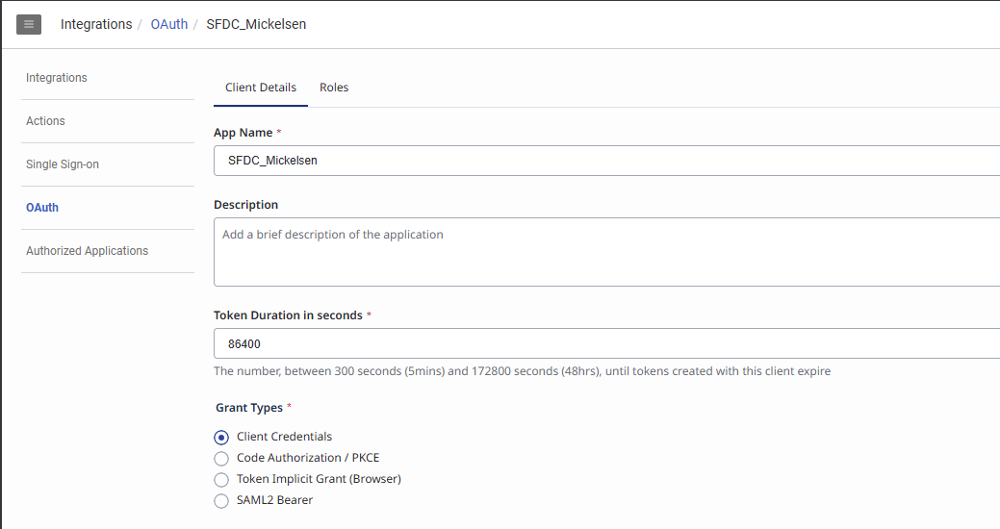


#### Create integration for use with Salesforce data action integration 


To enable a Genesys Cloud data action to make public API requests on behalf of your Genesys Cloud organization, create an integration to interact with Salesforce.


To create an integration in Genesys Cloud:


1. Navigate to **Admin** > **Integrations** > **Integrations** and click **+ Integrations**.


	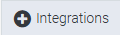


2. Select Salesforce Data Actions


	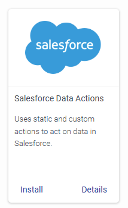


2. Enter a name for the integration and select the **Configuration** tab. Click **Credentials** and fill up the credentials required to access Salesforce.


	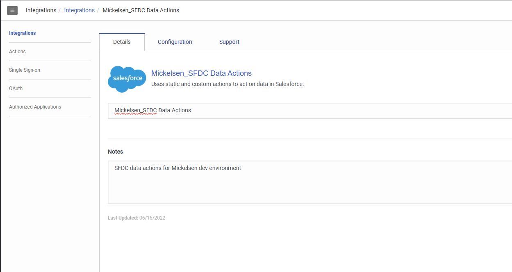


	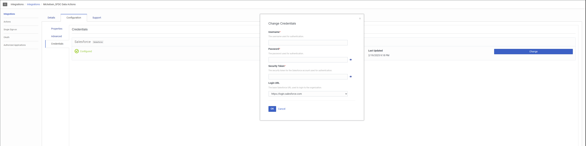


3. Once finished with editing, activate the integration


	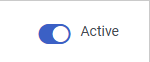


#### Create integration for use with Genesys Cloud data action integration 


To enable a Genesys Cloud data action to make public API requests on behalf of your Genesys Cloud organization, create an integration to interact with Genesys Cloud.


To create an integration in Genesys Cloud:


1. Navigate to **Admin** > **Integrations** > **Integrations** and click **+ Integrations**.


	


2. Select Genesys Cloud Data Actions


	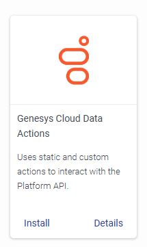


2. Enter a name for the integration and select the **Configuration** tab. Click **Credentials** and use the oauth client id and secret created earlier.


	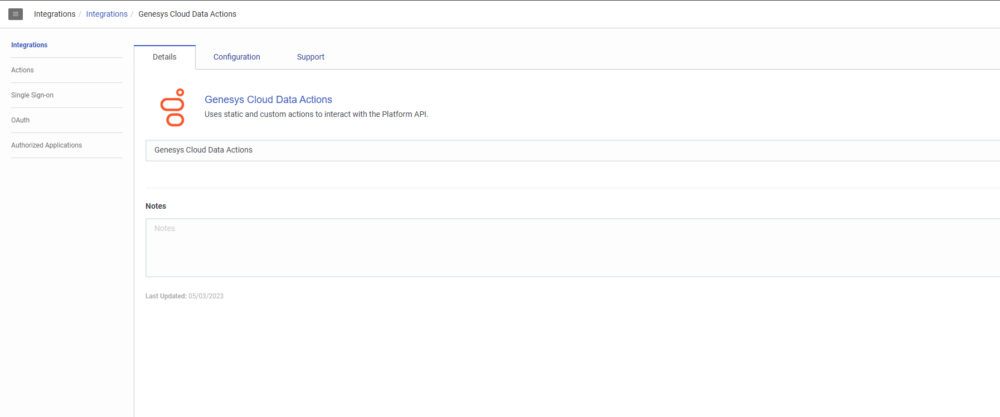


	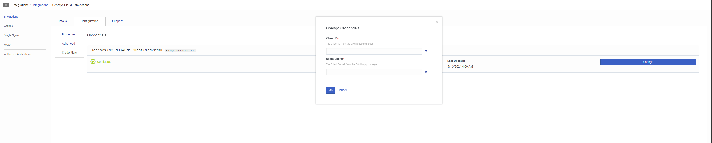


3. Once finished with editing, activate the integration


	

### Data Action

#### Import the Genesys Cloud data actions

1. In Genesys Cloud, navigate to **Admin** > **Integrations** > **Actions** and click **Import**.
2. Select the `get-contact-by-phone-number.json`, `get-summary.json` and `create-case.json` files and associate with "Process Automation Trigger with SalesForce" data action integration.
3. click **Import Action**.
4. Click **Save & Publish**

   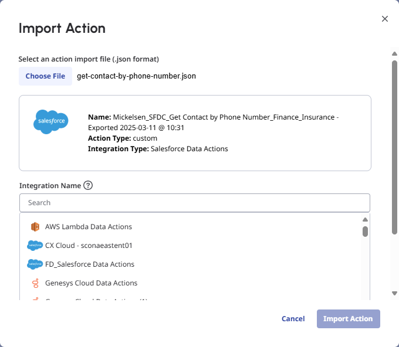

### Architect 


#### Import the Architect workflows 


This solution includes one Architect workflow that uses one [data action](#add-genesys-cloud-data-action-integrations "Goes to the Add a web services data actions integration section").


- The **Conversation Summary.i3WorkFlow** workflow is triggered when a conversation has ended. This workflow calls a data action to create a case on SalesForce.


First import this workflow to your Genesys Cloud organization:


1. Download the `Conversation Summary.i3WorkFlow` file from the [process-automation-trigger-with-salesforce](https://github.com/GenesysCloudBlueprints/process-automation-trigger-with-salesforce/tree/main/exports "Link") GitHub repository.
2. In Genesys Cloud, navigate to **Admin** > **Architect** > **Flows:Workflow** and click **Add**.
3. Enter a name for the workflow and click **Create Flow**.
4. From the **Save** menu, click **Import**.
5. Select the downloaded **Conversation Summary.i3WorkFlow** file and click **Import**.
6. Review your workflow. Click **Save** and then click **Publish**.


	**Note:** If you imported the `Conversation Summary.i3WorkFlow` file, your workflow will look like the flow below.


	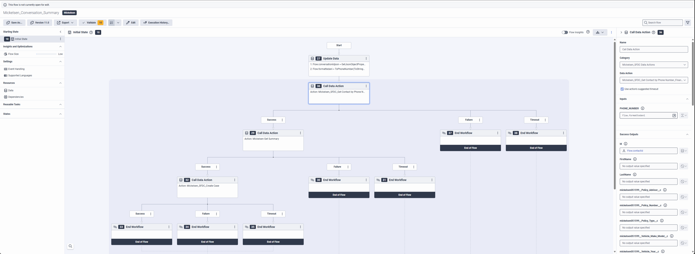


### Triggers 


Create the trigger that invokes the created Architect workflow.


1. In Genesys Cloud, navigate to **Admin** > **Architect** > **Triggers**.
2. From the Triggers list, click **Add Trigger**.
3. From the Add New Trigger modal, name your trigger and click **Add**.
4. From the Trigger single view input **Topic Name**, **Workflow Target**, and **Data Format** as mentioned in the table below.  


| Topic Name | Workflow Target | Data Format |
| :--- | :--- | :--- |
| v2.detail.events.conversation.{id}.acw | Create Case on SalesForce | TopLevelPrimitives |


5. Click **Save**.


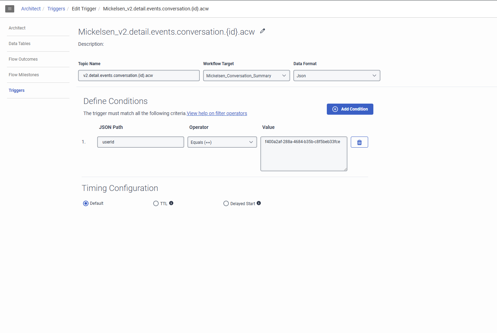

## Additional resources

* [Genesys Cloud API Explorer](https://developer.genesys.cloud/devapps/api-explorer "Opens the GC API Explorer") in the Genesys Cloud Developer Center
* [Genesys Cloud notification triggers](https://developer.genesys.cloud/notificationsalerts/notifications/available-topics "Opens the Available topics page") in the Genesys Cloud Developer Center
* The [process-automation-trigger-with-salesforce](https://github.com/GenesysCloudBlueprints/process-automation-trigger-with-salesforce) repository in GitHub